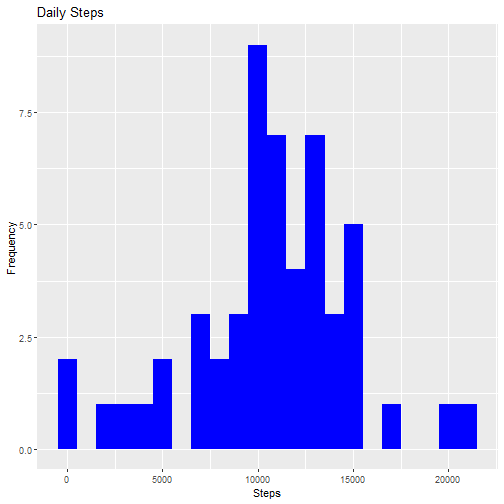
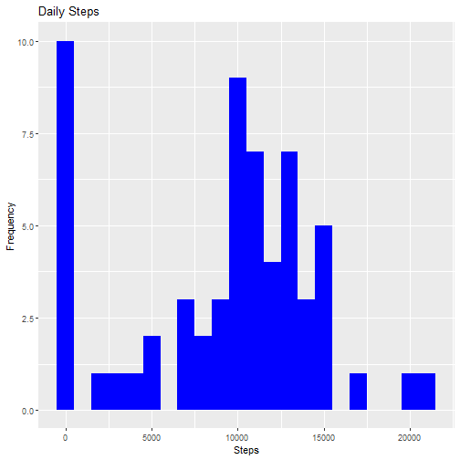

# Reproducible Research Project 1

By Arturo Vera
2020/06/28

## Introduction
It is now possible to collect a large amount of data about personal movement using activity monitoring devices such as a Fitbit, Nike Fuelband, or Jawbone Up. These type of devices are part of the “quantified self” movement – a group of enthusiasts who take measurements about themselves regularly to improve their health, to find patterns in their behavior, or because they are tech geeks. But these data remain under-utilized both because the raw data are hard to obtain and there is a lack of statistical methods and software for processing and interpreting the data.

This assignment makes use of data from a personal activity monitoring device. This device collects data at 5 minute intervals through out the day. The data consists of two months of data from an anonymous individual collected during the months of October and November, 2012 and include the number of steps taken in 5 minute intervals each day.

The data for this assignment can be downloaded from the course web site:

* Dataset: [Activity monitoring data](https://d396qusza40orc.cloudfront.net/repdata%2Fdata%2Factivity.zip) 

The variables included in this dataset are:

- steps: Number of steps taking in a 5-minute interval (missing values are coded as 𝙽𝙰) </br>
- date: The date on which the measurement was taken in YYYY-MM-DD format </br>
- interval: Identifier for the 5-minute interval in which measurement was taken </br>

The dataset is stored in a comma-separated-value (CSV) file and there are a total of 17,568 observations in this dataset. 

## Loading and preprocessing the data

### 1. Code for reading in the dataset and/or processing the data

1. Load the data

Unzip data to obtain a csv file.


```r
library("data.table")
```

```
## Warning: package 'data.table' was built under R version 3.6.3
```

```
## data.table 1.12.8 using 2 threads (see ?getDTthreads).  Latest news: r-datatable.com
```

```r
library(ggplot2)
```

```
## Warning: package 'ggplot2' was built under R version 3.6.3
```

```
## RStudio Community is a great place to get help: https://community.rstudio.com/c/tidyverse
```

```r
direc <- getwd()
download.file(url = "https://d396qusza40orc.cloudfront.net/repdata%2Fdata%2Factivity.zip", destfile = paste(direc, "dataactivity.zip", sep = "/"))
unzip(zipfile = "dataactivity.zip")
```

2. Process/transform the data (if necessary) into a format suitable for your analysis

Reading csv Data into Data.Table. 

```r
activityDT <- fread(input = "activity.csv")
```

## What is mean total number of steps taken per day?

1. Calculate the total number of steps taken per day

(NA's are not omitted)


```r
Tsteps <- activityDT[, c(lapply(.SD, sum, na.rm = FALSE)), .SDcols = c("steps"), by = .(date)] 
Tsteps
```

```
##           date steps
##  1: 2012-10-01    NA
##  2: 2012-10-02   126
##  3: 2012-10-03 11352
##  4: 2012-10-04 12116
##  5: 2012-10-05 13294
##  6: 2012-10-06 15420
##  7: 2012-10-07 11015
##  8: 2012-10-08    NA
##  9: 2012-10-09 12811
## 10: 2012-10-10  9900
## 11: 2012-10-11 10304
## 12: 2012-10-12 17382
## 13: 2012-10-13 12426
## 14: 2012-10-14 15098
## 15: 2012-10-15 10139
## 16: 2012-10-16 15084
## 17: 2012-10-17 13452
## 18: 2012-10-18 10056
## 19: 2012-10-19 11829
## 20: 2012-10-20 10395
## 21: 2012-10-21  8821
## 22: 2012-10-22 13460
## 23: 2012-10-23  8918
## 24: 2012-10-24  8355
## 25: 2012-10-25  2492
## 26: 2012-10-26  6778
## 27: 2012-10-27 10119
## 28: 2012-10-28 11458
## 29: 2012-10-29  5018
## 30: 2012-10-30  9819
## 31: 2012-10-31 15414
## 32: 2012-11-01    NA
## 33: 2012-11-02 10600
## 34: 2012-11-03 10571
## 35: 2012-11-04    NA
## 36: 2012-11-05 10439
## 37: 2012-11-06  8334
## 38: 2012-11-07 12883
## 39: 2012-11-08  3219
## 40: 2012-11-09    NA
## 41: 2012-11-10    NA
## 42: 2012-11-11 12608
## 43: 2012-11-12 10765
## 44: 2012-11-13  7336
## 45: 2012-11-14    NA
## 46: 2012-11-15    41
## 47: 2012-11-16  5441
## 48: 2012-11-17 14339
## 49: 2012-11-18 15110
## 50: 2012-11-19  8841
## 51: 2012-11-20  4472
## 52: 2012-11-21 12787
## 53: 2012-11-22 20427
## 54: 2012-11-23 21194
## 55: 2012-11-24 14478
## 56: 2012-11-25 11834
## 57: 2012-11-26 11162
## 58: 2012-11-27 13646
## 59: 2012-11-28 10183
## 60: 2012-11-29  7047
## 61: 2012-11-30    NA
##           date steps
```

### 2. Histogram of the total number of steps taken each day

2. If you do not understand the difference between a histogram and a barplot, research the difference between them. Make a histogram of the total number of steps taken each day


```r
ggplot(Tsteps, aes(x = steps)) +
geom_histogram(fill = "blue", binwidth = 1000) +
labs(title = "Daily Steps", x = "Steps", y = "Frequency")
```

```
## Warning: Removed 8 rows containing non-finite values (stat_bin).
```



### 3. Mean and median number of steps taken each day

3. Calculate and report the mean and median of the total number of steps taken per day


```r
Tsteps[, .(Mean_Steps = mean(steps, na.rm = TRUE), Median_Steps = median(steps, na.rm = TRUE))]
```

```
##    Mean_Steps Median_Steps
## 1:   10766.19        10765
```

## What is the average daily activity pattern?

### 4. Time series plot of the average number of steps taken

1. Make a time series plot (i.e. \color{red}{\verb|type = "l"|}type = "l") of the 5-minute interval (x-axis) and the average number of steps taken, averaged across all days (y-axis)


```r
IntervalDT <- activityDT[, c(lapply(.SD, mean, na.rm = TRUE)), .SDcols = c("steps"), by = .(interval)] 
ggplot(IntervalDT, aes(x = interval , y = steps)) + 
geom_line(color="blue", size=1) + 
labs(title = "Average number of daily steps per interval", x = "Interval", y = "Average steps per day")
```


### 5. The 5-minute interval that, on average, contains the maximum number of steps

2. Which 5-minute interval, on average across all the days in the dataset, contains the maximum number of steps?


```r
IntervalDT[steps == max(steps), .(max_interval = interval)]
```

```
##    max_interval
## 1:          835
```

## Imputing missing values

### 6. Code to describe and show a strategy for imputing missing data

1. Calculate and report the total number of missing values in the dataset (i.e. the total number of rows with 𝙽𝙰s)


```r
activityDT[is.na(steps), .N ]
```

```
## [1] 2304
```

2. Devise a strategy for filling in all of the missing values in the dataset. The strategy does not need to be sophisticated. For example, you could use the mean/median for that day, or the mean for that 5-minute interval, etc.


```r
# Filling in missing values with median of dataset. 
activityDT[is.na(steps), "steps"] <- activityDT[, c(lapply(.SD, median, na.rm = TRUE)), .SDcols = c("steps")]
```

3. Create a new dataset that is equal to the original dataset but with the missing data filled in.


```r
fwrite(x = activityDT, file = "tidyData.csv", quote = FALSE)
```

### 7. Histogram of the total number of steps taken each day after missing values are imputed

4. Make a histogram of the total number of steps taken each day and calculate and report the mean and median total number of steps taken per day. Do these values differ from the estimates from the first part of the assignment? What is the impact of imputing missing data on the estimates of the total daily number of steps?


```r
# total number of steps taken per day
Tsteps <- activityDT[, c(lapply(.SD, sum)), .SDcols = c("steps"), by = .(date)] 
# mean and median total number of steps taken per day
Tsteps[, .(Mean_Steps = mean(steps), Median_Steps = median(steps))]
```

```
##    Mean_Steps Median_Steps
## 1:    9354.23        10395
```

```r
ggplot(Tsteps, aes(x = steps)) + 
geom_histogram(fill = "blue", binwidth = 1000) + 
labs(title = "Daily Steps", x = "Steps", y = "Frequency")
```



Type of Estimate | Mean_Steps | Median_Steps
--- | --- | ---
First Part (with na) | 10765 | 10765
Second Part (fillin in na with median) | 9354.23 | 10395

## Are there differences in activity patterns between weekdays and weekends?

1. Create a new factor variable in the dataset with two levels – “weekday” and “weekend” indicating whether a given date is a weekday or weekend day.


```r
activityDT <- fread(input = "activity.csv")
activityDT[, date := as.POSIXct(date, format = "%Y-%m-%d")]
activityDT[, `Day`:= weekdays(x = date)]
activityDT[grepl(pattern = "lunes|martes|miércoles|jueves|viernes", x = `Day`), "wday_wend"] <- "weekday"
activityDT[grepl(pattern = "sábado|domingo", x = `Day`), "wday_wend"] <- "weekend"
activityDT[, `wday_wend` := as.factor(`wday_wend`)]
head(activityDT, 25)
```

```
##     steps       date interval   Day wday_wend
##  1:    NA 2012-10-01        0 lunes   weekday
##  2:    NA 2012-10-01        5 lunes   weekday
##  3:    NA 2012-10-01       10 lunes   weekday
##  4:    NA 2012-10-01       15 lunes   weekday
##  5:    NA 2012-10-01       20 lunes   weekday
##  6:    NA 2012-10-01       25 lunes   weekday
##  7:    NA 2012-10-01       30 lunes   weekday
##  8:    NA 2012-10-01       35 lunes   weekday
##  9:    NA 2012-10-01       40 lunes   weekday
## 10:    NA 2012-10-01       45 lunes   weekday
## 11:    NA 2012-10-01       50 lunes   weekday
## 12:    NA 2012-10-01       55 lunes   weekday
## 13:    NA 2012-10-01      100 lunes   weekday
## 14:    NA 2012-10-01      105 lunes   weekday
## 15:    NA 2012-10-01      110 lunes   weekday
## 16:    NA 2012-10-01      115 lunes   weekday
## 17:    NA 2012-10-01      120 lunes   weekday
## 18:    NA 2012-10-01      125 lunes   weekday
## 19:    NA 2012-10-01      130 lunes   weekday
## 20:    NA 2012-10-01      135 lunes   weekday
## 21:    NA 2012-10-01      140 lunes   weekday
## 22:    NA 2012-10-01      145 lunes   weekday
## 23:    NA 2012-10-01      150 lunes   weekday
## 24:    NA 2012-10-01      155 lunes   weekday
## 25:    NA 2012-10-01      200 lunes   weekday
##     steps       date interval   Day wday_wend
```

### 8. Panel plot comparing the average number of steps taken per 5-minute interval across weekdays and weekends

2. Make a panel plot containing a time series plot (i.e. 𝚝𝚢𝚙𝚎 = "𝚕") of the 5-minute interval (x-axis) and the average number of steps taken, averaged across all weekday days or weekend days (y-axis). See the README file in the GitHub repository to see an example of what this plot should look like using simulated data.


```r
activityDT[is.na(steps), "steps"] <- activityDT[, c(lapply(.SD, median, na.rm = TRUE)), .SDcols = c("steps")]
IntervalDT <- activityDT[, c(lapply(.SD, mean, na.rm = TRUE)), .SDcols = c("steps"), by = .(interval, `wday_wend`)] 
ggplot(IntervalDT , aes(x = interval , y = steps, color=`wday_wend`)) + 
geom_line() + 
labs(title = "Average Daily Steps by Weektype", x = "Interval", y = "Number of Steps") + 
facet_wrap(~`wday_wend`, ncol = 1, nrow=2)
```


